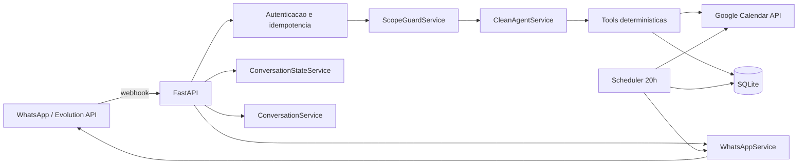
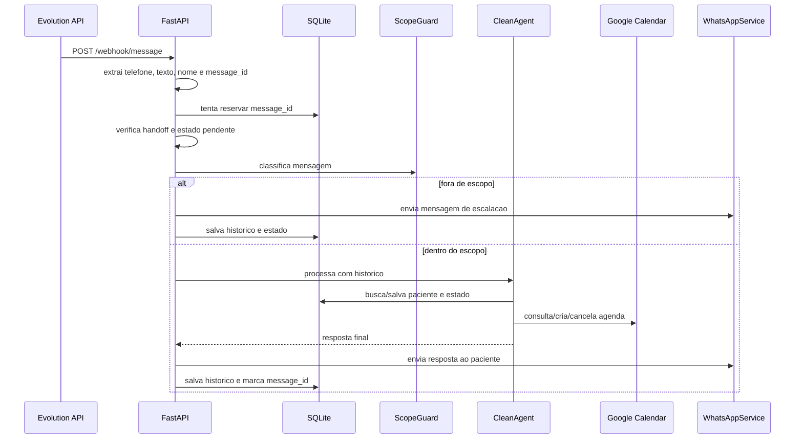

# WPP-DENTAL - Documentacao Tecnica

## 1. Visao Geral

O WPP-DENTAL e um backend Python para atendimento odontologico via WhatsApp. A solucao recebe mensagens pela Evolution API, interpreta a conversa com um agente LLM apoiado por ferramentas deterministicas, consulta e altera a agenda no Google Calendar, persiste historico/estado em SQLite e envia respostas pelo WhatsApp.

Principais capacidades:

- Atendimento inicial de pacientes novos e recorrentes.
- Consulta de convenios e regras operacionais.
- Sugestao de horarios disponiveis.
- Agendamento, remarcacao e cancelamento de consultas.
- Confirmacao automatica de consultas do dia seguinte.
- Handoff manual quando a doutora assume a conversa.
- Escalacao segura para temas fora de escopo, como preco e duvidas clinicas.
- Idempotencia para evitar reprocessamento de webhooks duplicados.

## 2. Stack Tecnica

| Categoria | Tecnologia |
| --- | --- |
| Linguagem | Python 3.11+ |
| API HTTP | FastAPI |
| Servidor ASGI | Uvicorn |
| Banco local | SQLite com WAL |
| LLM | OpenAI via LangChain (`langchain-openai`) |
| Tool calling | LangChain `StructuredTool` |
| Agenda | Google Calendar API |
| WhatsApp | Evolution API |
| Configuracao | `.env` e YAML |
| Testes | pytest |
| Deploy | Docker, EasyPanel ou VPS/systemd |

## 3. Estrutura do Projeto

```text
wpp-dental/
|-- config/
|   |-- messages.yaml
|   |-- plans.yaml
|   |-- procedure_rules.yaml
|   `-- settings.yaml
|-- deploy/
|   |-- start.sh
|   `-- wpp-dental.service
|-- docs/
|   `-- TECHNICAL_DOCUMENTATION.md
|-- src/
|   |-- application/
|   |   `-- services/
|   |-- domain/
|   |   |-- entities/
|   |   `-- policies/
|   |-- infrastructure/
|   |   |-- config/
|   |   |-- integrations/
|   |   `-- persistence/
|   `-- interfaces/
|       |-- http/
|       `-- tools/
|-- tests/
|-- Dockerfile
|-- README.md
|-- pyproject.toml
`-- requirements.txt
```

## 4. Arquitetura

A aplicacao segue uma organizacao inspirada em arquitetura limpa:

| Camada | Responsabilidade | Exemplos |
| --- | --- | --- |
| `interfaces` | Entrada/saida externa, HTTP e ferramentas expostas ao agente | `interfaces/http/app.py`, `interfaces/tools/*.py` |
| `application` | Casos de uso, orquestracao conversacional e servicos de fluxo | `CleanAgentService`, `ConversationService`, `AppointmentConfirmationService` |
| `domain` | Regras puras de negocio e politicas reutilizaveis | `ScopeGuardService`, `AppointmentOfferService`, normalizacao de telefone |
| `infrastructure` | Persistencia, configuracao, logging e integracoes externas | SQLite, Google Calendar, Evolution API |

### 4.1 Diagrama de Componentes



## 5. Ponto de Entrada e Ciclo de Vida

O ponto de entrada publico e `src.main:app`, que reexporta a instancia FastAPI definida em `src/interfaces/http/app.py`.

No startup (`lifespan`):

1. Carrega variaveis de ambiente com `python-dotenv`.
2. Configura logging.
3. Inicializa o SQLite com tabelas e migracoes leves.
4. Carrega YAMLs via `ConfigService`.
5. Inicia o scheduler interno de confirmacao, se `ENABLE_APPOINTMENT_CONFIRMATION_SCHEDULER` estiver habilitado.

No shutdown:

1. Cancela a task do scheduler.
2. Fecha a conexao SQLite da thread atual.

## 6. Endpoints HTTP

### `GET /`

Health check simples para plataformas de deploy.

Resposta:

```json
{
  "status": "ok",
  "service": "wpp-dental"
}
```

### `GET /health`

Health check principal da aplicacao.

Resposta:

```json
{
  "status": "ok",
  "service": "wpp-dental"
}
```

### `POST /webhook/message`

Endpoint principal chamado pela Evolution API quando uma mensagem chega ou e enviada pela propria instancia.

Comportamentos importantes:

- Aceita eventos `messages.upsert`, `MESSAGES_UPSERT` e `messages`.
- Ignora eventos nao suportados.
- Extrai texto de `conversation` ou `extendedTextMessage.text`.
- Ignora mensagens sem texto.
- Usa `message_id` para idempotencia na tabela `processed_messages`.
- Se `fromMe=true`, trata como eco de mensagem automatica ou handoff manual.
- Se o handoff estiver ativo, registra a mensagem e nao responde.
- Executa guardas de escopo antes do agente.
- Processa estados pendentes antes do LLM, como confirmacao de slot, pedido de plano e confirmacao proativa.
- Envia a resposta via Evolution API.

Headers/chaves aceitos para autenticacao:

- `apikey`
- `x-api-key`
- `x-webhook-key`
- `Authorization: Bearer <token>`
- Query string: `apikey`, `token`, `key`
- Payload: `apikey`, `token`, `key`

Observacao: por compatibilidade com a Evolution API, o webhook principal atualmente aceita requisicoes sem chave valida quando `allow_unauthorized=True`, mas registra alerta. Para operacao segura, configure `WEBHOOK_API_KEY`.

### `POST /webhook/reload-config`

Recarrega os arquivos YAML sem reiniciar a aplicacao.

Requer chave valida.

Resposta de sucesso:

```json
{
  "status": "ok",
  "plans": ["Particular", "..."],
  "doctor": "Dra. Priscila"
}
```

## 7. Fluxo de Mensagem Recebida



## 8. Motor Conversacional

O motor principal e `CleanAgentService`.

Ele usa:

- `ChatOpenAI` com modelo vindo de `OPENAI_MODEL` ou de `config/settings.yaml`.
- Temperatura `0`.
- Limite de ate 8 iteracoes de tool calling por mensagem.
- Prompt de sistema construido dinamicamente com dados da clinica, planos, regras de procedimento, periodos e data atual em `America/Sao_Paulo`.
- Historico recente formatado por `ConversationService`.

### 8.1 Regras Criticas do Agente

O prompt e as validacoes em codigo reforcam estas regras:

- O telefone do paciente vem da API e nao deve ser pedido.
- No inicio, deve chamar `buscar_paciente`.
- Paciente novo precisa informar nome completo antes de continuar.
- Ao obter nome, deve salvar paciente.
- Convenio precisa ser validado antes de confirmar atendimento.
- Antes de buscar horarios, deve entender data e periodo desejados.
- Deve oferecer exatamente a quantidade configurada de horarios, hoje `2`.
- So pode agendar horario que tenha sido retornado por ferramenta e salvo no estado.
- Nao deve informar preco, diagnostico ou orientacao clinica.
- Em caso de assunto fora de escopo, deve encaminhar para a doutora.

### 8.2 Tools Disponiveis ao Agente

| Tool | Origem | Funcao |
| --- | --- | --- |
| `buscar_horarios_disponiveis` | `calendar_tool.py` | Lista slots livres em uma data e periodo |
| `buscar_proximo_dia_disponivel` | `calendar_tool.py` | Busca o proximo dia util com slots |
| `criar_agendamento` | `calendar_tool.py` | Cria evento no Google Calendar apos validacoes |
| `cancelar_agendamento` | `calendar_tool.py` | Cancela consulta futura pelo evento correto |
| `consultar_agendamento` | `calendar_tool.py` | Lista consultas futuras do telefone |
| `verificar_convenio` | `config_tool.py` | Valida plano, restricoes e encaminhamento |
| `listar_convenios` | `config_tool.py` | Lista planos ativos |
| `buscar_paciente` | `patient_tool.py` | Busca paciente no SQLite |
| `salvar_paciente` | `patient_tool.py` | Cria ou atualiza paciente |
| `registrar_interacao` | `patient_tool.py` | Registra historico operacional |

## 9. Estado e Historico Conversacional

### 9.1 Historico

`ConversationService` persiste mensagens em `conversation_history`.

- Janela de contexto: 60 minutos.
- Limite padrao carregado para o prompt: 20 mensagens recentes.
- Roles usadas: `patient`, `assistant`, `doctor`.
- Quando a ultima resposta da assistente indica conclusao, o contexto e limpo antes de novo atendimento.

### 9.2 Estado Estruturado

`ConversationStateService` persiste um JSON por telefone em `conversation_state`.

Campos principais:

| Campo | Uso |
| --- | --- |
| `stage` | Estado atual: `idle`, `handoff_active`, `awaiting_plan_for_slot_confirmation`, `awaiting_appointment_confirmation`, etc. |
| `intent` | Intencao operacional, como remarcacao |
| `patient_name` | Nome validado na conversa |
| `plan_name` | Convenio/plano validado |
| `pending_event_id` | Evento aguardando confirmacao/cancelamento |
| `reschedule_event_id` | Evento original em remarcacao |
| `offered_date` | Data dos horarios ofertados |
| `offered_times` | Horarios ofertados, usados para impedir agendamento fora da lista |
| `pending_slot_date` / `pending_slot_time` | Slot escolhido aguardando plano ou confirmacao |
| `metadata` | Dados auxiliares, como confirmacao proativa e handoff |

## 10. Persistencia

O SQLite e inicializado automaticamente em `src/infrastructure/persistence/connection.py`.

Banco padrao:

```text
./data/dental.db
```

Pode ser alterado por:

```text
DATABASE_PATH=/caminho/para/dental.db
```

### 10.1 Tabelas

| Tabela | Finalidade |
| --- | --- |
| `patients` | Cadastro minimo de paciente por telefone, nome e plano |
| `interactions` | Registro de interacoes operacionais |
| `conversation_history` | Historico textual das conversas |
| `conversation_state` | Estado estruturado por telefone |
| `processed_messages` | Idempotencia de webhooks |
| `appointment_confirmations` | Controle de confirmacoes automaticas enviadas |
| `outbound_messages` | Controle de mensagens enviadas para ignorar ecos da Evolution |

### 10.2 Idempotencia

Quando chega uma mensagem com `message_id`, a aplicacao:

1. Insere `message_id` em `processed_messages` com status `processing`.
2. Se ja existir como `processed`, ignora como duplicada.
3. Se estiver `failed`, permite retry.
4. Se estiver `processing` ha mais de 5 minutos, considera stale e reprocessa.
5. Ao final, marca como `processed` ou `failed`.

## 11. Integracoes Externas

### 11.1 Evolution API

Classe: `WhatsAppService`.

Variaveis:

| Variavel | Uso |
| --- | --- |
| `EVOLUTION_API_URL` | Base URL da Evolution API |
| `EVOLUTION_API_KEY` | Chave para chamadas HTTP |
| `EVOLUTION_INSTANCE` | Nome da instancia |

Envio de mensagem:

```text
POST {EVOLUTION_API_URL}/message/sendText/{EVOLUTION_INSTANCE}
```

Payload:

```json
{
  "number": "5511999999999",
  "text": "mensagem"
}
```

### 11.2 Google Calendar

Classe: `CalendarService`.

Escopo usado:

```text
https://www.googleapis.com/auth/calendar
```

Formas suportadas de credencial, em ordem pratica:

1. Arquivo indicado por `GOOGLE_SERVICE_ACCOUNT_FILE`.
2. Arquivo `/app/credentials/service-account.json`.
3. Arquivo `./credentials/service-account.json`.
4. JSON completo em `GOOGLE_SERVICE_ACCOUNT_JSON`.
5. JSON completo em base64 em `GOOGLE_SERVICE_ACCOUNT_JSON_BASE64`.
6. Par minimo `GOOGLE_SERVICE_ACCOUNT_EMAIL` + `GOOGLE_PRIVATE_KEY`.

Eventos criados usam:

- `summary`: `<nome> - <telefone_normalizado>`
- `description`: origem do agendamento, paciente e telefone.
- Timezone: `America/Sao_Paulo`.

### 11.3 OpenAI

Variaveis:

| Variavel | Uso |
| --- | --- |
| `OPENAI_API_KEY` | Credencial da API |
| `OPENAI_MODEL` | Override opcional do modelo usado pelo agente |

Modelo padrao via YAML:

```yaml
openai:
  model: "gpt-4o-mini"
  temperature: 0.2
```

Observacao: o `CleanAgentService` usa temperatura `0` diretamente para reduzir variacao operacional.

## 12. Configuracao por YAML

Os arquivos em `config/` sao carregados pelo singleton `ConfigService`.

| Arquivo | Conteudo |
| --- | --- |
| `settings.yaml` | Dados da doutora, agenda, periodos, limites de agendamento e modelo |
| `plans.yaml` | Planos ativos, aliases, restricoes e encaminhamentos |
| `procedure_rules.yaml` | Regras operacionais por procedimento |
| `messages.yaml` | Templates de saudacao, erro, escalacao e confirmacao |

O endpoint `/webhook/reload-config` permite hot reload sem restart.

## 13. Regras de Agendamento

As principais validacoes antes de criar evento:

- Nome do paciente precisa existir e nao pode ser generico.
- Horario precisa estar no futuro.
- Finais de semana nao sao aceitos.
- Minuto precisa respeitar a duracao do slot configurado.
- Horario precisa caber em algum periodo de atendimento.
- Data maxima respeita `scheduling.max_days_ahead`.
- Conflitos sao verificados no Calendar antes da criacao.
- Criacao usa lock em processo para reduzir corrida concorrente.
- O agente so pode criar agendamento em horario previamente ofertado na conversa.

Parametros atuais em `settings.yaml`:

| Parametro | Valor |
| --- | --- |
| Slot | 15 minutos |
| Sugestoes por oferta | 2 |
| Antecedencia minima | 2 dias uteis |
| Janela maxima | 30 dias |
| Dias de atendimento | Segunda a sexta-feira |
| Idade minima | 8 anos |

## 14. Confirmacao Automatica de Consultas

`AppointmentConfirmationService` roda uma rotina interna diaria as 20:00 no timezone `America/Sao_Paulo`, quando habilitada.

Variavel:

```text
ENABLE_APPOINTMENT_CONFIRMATION_SCHEDULER=1
```

Fluxo:

1. Calcula a proxima execucao as 20:00.
2. Busca no Google Calendar consultas do dia seguinte.
3. Deduplica por telefone, mantendo a consulta mais cedo.
4. Pula pacientes com estado recente ocupado.
5. Registra tentativa em `appointment_confirmations`.
6. Envia mensagem de confirmacao pelo WhatsApp.
7. Salva historico e estado `awaiting_appointment_confirmation`.

Respostas tratadas nativamente:

| Resposta do paciente | Acao |
| --- | --- |
| Confirmacao afirmativa | Limpa estado e confirma no chat |
| Pedido de remarcar | Muda intencao para remarcacao |
| Cancelar/nao comparecer | Cancela evento no Calendar e limpa estado |

Importante: com SQLite e scheduler interno, use apenas uma replica/processo em producao.

## 15. Handoff Manual

O handoff evita que o bot responda quando a doutora assume a conversa manualmente.

Como ativa:

- Webhook `fromMe=true` que nao seja eco de mensagem automatica.
- Resposta da IA com marcadores de encaminhamento para a doutora.

Duracao:

```text
30 minutos
```

Durante o handoff:

- Mensagens do paciente sao salvas no historico.
- O agente nao responde.
- Ao expirar, o estado e limpo automaticamente.

## 16. Guardas de Escopo

`ScopeGuardService` aplica regras deterministicas antes e depois do LLM.

Escala para a doutora quando detecta:

- Pedido de preco, valor ou orcamento.
- Sintomas ou duvidas clinicas.
- Perguntas sobre procedimento fora das regras operacionais permitidas.

Tambem valida a resposta gerada para bloquear:

- Valores monetarios.
- Orientacao clinica.
- Recomendacoes de tratamento.
- Conteudo sobre procedimento fora do escopo.

Quando ha escalacao:

1. Envia alerta para a doutora via `AlertService`.
2. Envia mensagem segura ao paciente.
3. Limpa estado da conversa.
4. Registra historico.

## 17. Variaveis de Ambiente

| Variavel | Obrigatoria | Descricao |
| --- | --- | --- |
| `OPENAI_API_KEY` | Sim | Chave da OpenAI |
| `OPENAI_MODEL` | Nao | Override do modelo LLM |
| `EVOLUTION_API_URL` | Sim | URL da Evolution API |
| `EVOLUTION_API_KEY` | Sim | Chave da Evolution API |
| `EVOLUTION_INSTANCE` | Sim | Instancia do WhatsApp |
| `WEBHOOK_API_KEY` | Recomendado | Chave dedicada do webhook |
| `EVOLUTION_WEBHOOK_API_KEY` | Nao | Chave alternativa para webhook |
| `GOOGLE_CALENDAR_ID` | Sim | ID do calendario |
| `GOOGLE_SERVICE_ACCOUNT_FILE` | Condicional | Caminho do JSON de service account |
| `GOOGLE_SERVICE_ACCOUNT_JSON` | Condicional | JSON completo da service account |
| `GOOGLE_SERVICE_ACCOUNT_JSON_BASE64` | Condicional | JSON em base64 |
| `GOOGLE_SERVICE_ACCOUNT_EMAIL` | Condicional | Email da service account |
| `GOOGLE_PRIVATE_KEY` | Condicional | Chave privada da service account |
| `DOCTOR_PHONE` | Sim | WhatsApp da doutora para alertas |
| `DATABASE_PATH` | Nao | Caminho do SQLite |
| `HOST` | Nao | Host do Uvicorn |
| `PORT` | Nao | Porta do Uvicorn |
| `WORKERS` | Nao | Numero de workers; recomendado `1` |
| `ENABLE_APPOINTMENT_CONFIRMATION_SCHEDULER` | Nao | Liga/desliga confirmacao automatica |
| `LOG_LEVEL` | Nao | Nivel de logs |
| `CONVERSATION_ENGINE` | Legado/documentado | Mantido no `.env.example`; o engine atual instanciado e `CleanAgentService` |
| `LANGGRAPH_OPENAI_MODEL` | Legado/documentado | Mantido para compatibilidade/documentacao anterior |
| `LANGGRAPH_FALLBACK_TO_LEGACY` | Legado/documentado | Mantido para compatibilidade/documentacao anterior |

## 18. Execucao Local

Windows PowerShell:

```powershell
python -m venv .venv
.\.venv\Scripts\activate
pip install -e .[dev]
copy .env.example .env
uvicorn src.main:app --host 0.0.0.0 --port 3000 --reload
```

Linux/macOS:

```bash
python3 -m venv .venv
source .venv/bin/activate
pip install -e ".[dev]"
cp .env.example .env
uvicorn src.main:app --host 0.0.0.0 --port 3000 --reload
```

## 19. Deploy

### 19.1 Docker/EasyPanel

O `Dockerfile`:

- Usa `python:3.11-slim`.
- Instala `requirements.txt`.
- Copia o projeto.
- Cria `data` e `credentials`.
- Expoe a porta `3000`.
- Executa `deploy/start.sh`.

Recomendacoes:

- Porta da aplicacao: `3000`.
- Replicas: `1`.
- Volume persistente para `/app/data`.
- Secret/volume para `/app/credentials/service-account.json`, ou use JSON/base64 por env.
- `WORKERS=1`, por causa de SQLite e scheduler interno.

### 19.2 VPS com systemd

Passos basicos:

```bash
git clone <repo-url> /opt/wpp-dental
cd /opt/wpp-dental
python3 -m venv .venv
source .venv/bin/activate
pip install -r requirements.txt
cp .env.example .env
chmod +x deploy/start.sh
./deploy/start.sh
```

Para systemd, ajuste `deploy/wpp-dental.service` antes de copiar para `/etc/systemd/system/`.

## 20. Testes

Com ambiente virtual ativo:

```powershell
.\.venv\Scripts\python -m pytest -q
```

Principais areas cobertas:

| Arquivo | Area |
| --- | --- |
| `test_main_webhook.py` | Webhook principal |
| `test_conversation_service.py` | Historico e contexto |
| `test_conversation_workflow_service.py` | Fluxos conversacionais |
| `test_conversation_context_validation.py` | Cenarios humanos simulados |
| `test_appointment_offer_service.py` | Selecao de horarios ofertados |
| `test_appointment_confirmation_service.py` | Confirmacao proativa |
| `test_calendar_rules.py` | Regras de agenda |
| `test_config.py` / `test_config_tool.py` | Configuracoes e convenios |
| `test_database.py` | Persistencia |
| `test_scope_guard_service.py` | Guardas de escopo |
| `test_phone_normalization.py` | Normalizacao de telefone |

## 21. Observabilidade e Logs

O logging e configurado por `src/infrastructure/logging_config.py`.

Eventos relevantes registrados:

- Startup/shutdown.
- Configuracoes carregadas.
- Modelo LLM.
- Mensagens recebidas.
- Duplicidade/idempotencia de webhook.
- Handoff ativo.
- Falhas de processamento.
- Falhas de envio WhatsApp.
- Falhas e estatisticas da confirmacao automatica.
- Tentativas bloqueadas de agendar horario nao ofertado.

Use `LOG_LEVEL=DEBUG` para diagnostico mais detalhado.

## 22. Seguranca

Pontos importantes:

- Nao versionar `.env`, banco SQLite real ou credenciais Google.
- Configurar `WEBHOOK_API_KEY`.
- Restringir acesso externo aos endpoints administrativos.
- Manter somente uma replica com SQLite.
- Usar volumes persistentes para `/app/data`.
- Usar secrets do provedor de deploy para credenciais.
- Service account do Google deve ter acesso apenas ao calendario necessario.

## 23. Limitacoes Conhecidas

- SQLite nao e adequado para multiplas replicas concorrentes.
- Scheduler interno pode enviar duplicado se houver mais de uma instancia ativa.
- Lock de criacao de consulta protege apenas dentro do mesmo processo.
- Webhook principal aceita chamadas sem chave valida por compatibilidade, embora registre alerta.
- A agenda depende da disponibilidade e consistencia da Google Calendar API.
- Mensagens sem texto sao ignoradas; audio, imagem e documentos nao sao interpretados.

## 24. Guia de Manutencao

### Alterar horarios de atendimento

Editar `config/settings.yaml`:

```yaml
periods:
  manha:
    start: "07:00"
    end: "12:00"
```

Depois chamar:

```bash
curl -X POST http://localhost:3000/webhook/reload-config -H "x-api-key: <WEBHOOK_API_KEY>"
```

### Adicionar convenio

Editar `config/plans.yaml` e incluir nome, aliases, restricoes e se exige encaminhamento.

### Alterar mensagens do bot

Editar `config/messages.yaml`.

### Alterar regras de procedimento

Editar `config/procedure_rules.yaml`.

### Investigar webhook duplicado

Consultar `processed_messages` no SQLite:

```sql
SELECT message_id, phone, status, last_error, processed_at
FROM processed_messages
ORDER BY processed_at DESC
LIMIT 20;
```

### Investigar estado preso

Consultar ou limpar `conversation_state`:

```sql
SELECT phone, state_json, updated_at
FROM conversation_state
ORDER BY updated_at DESC;
```

```sql
DELETE FROM conversation_state WHERE phone = '<telefone>';
```

## 25. Contratos Operacionais

Para a solucao operar corretamente:

- Evolution API deve enviar webhooks para `/webhook/message`.
- A instancia da Evolution deve estar conectada ao WhatsApp.
- A service account deve ter permissao no Google Calendar configurado.
- `OPENAI_API_KEY` precisa estar valida.
- `DATABASE_PATH` precisa apontar para local gravavel e persistente.
- `WORKERS` e replicas devem permanecer em `1`.
- O container/processo precisa estar online as 20:00 para confirmacoes automaticas.

